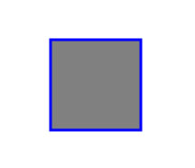
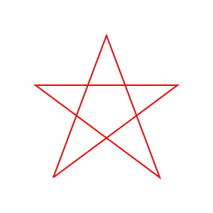

#LAB de testes com Canvas

##Proprieadades principais até o momento

##Início
>#####Antes de tudo deve-se criar uma tag <canvas\> no HTML e esta deve conter inicialmente um width="" e um height="" mesmo que estas propriedades sejam alteradas futuramente, também é interessante colocar alguma mensagem ou imagem dentro da tag canvas para agir como um Fallback caso o browser não suporte o uso de canvas, exemplo:

```html
  <!DOCTYPE html>
  <html lang="en">
  <head>
  	<meta charset="UTF-8">
  	<title>Document</title>
  </head>
  <body>
  	<canvas id="mycanvas" width="WIDTH" height="HEIGHT">
  	  Your Browser does not support Canvas, please upgrade
  	</canvas>
  </body>
  </html>
```

---------------------------------------------

###Referenciando Canvas e Pegando seu Contexto
#####Recuperando a tag canvas em uma variavel
```javascript
var canvas = document.getElementById('mycanvas');
```

#####Pegando o contexto do canvas
```javascript
var ctx = canvas.getContext('2d');
```

-----------------------------------------------

###Retângulo


####fillRect(x , y, width, height );

Um retângulo preenchido com o posicionamento baseado em x,y e medidas de width, height

-----------------------------------------------
####strokeRect(x, y, width, height);
Um retângulo somente borda com o posicionamento baseado em x,y e medidas de width, height

-----------------------------------------------

####strokeStyle ,fillStyle e lineWidth
Definem a cor do preenchimento, da borda e espessura da borda do canvas sucessivamente, exemplo:
```javascript
  ctx.fillStyle = "red";
  ctx.strokeStyle = "black";
  ctx.lineWidth = 3;
```

Exemplo usando fill e stroke juntos

```javascript
<!DOCTYPE html>
<html lang="en">
<head>
  <meta charset="UTF-8">
  <title>Document</title>
</head>
<body>
  <canvas id="mycanvas" width="300" height="300">Your Browser does not support Canvas, please upgrade</canvas>
  <script>
    var canvas = document.getElementById('mycanvas');
    var ctx = canvas.getContext('2d');
    
    ctx.fillStyle = "gray";
    ctx.strokeStyle = "blue";
    ctx.lineWidth = 3;

    ctx.fillRect(50, 50, 100, 100);
    ctx.strokeRect(50, 50, 100, 100);
  </script>
</body>
</html>
```

####Resultado


------------------------------------------------------------

##Paths - Caminhos
Path é a possibilidade de desenhar caminhos mais complexos no canvas, desde que informadas as coordenadas necessárias é possível desenhar qualquer cooisa com eles, para trabalhar com Path, algumas propriedades são necessárias, são elas:

####ctx.beginPath();

Inicia um novo Path apagando desenhos anteriores

------------------------------------------------------

####ctx.moveTo(75, 250);

Posiciona o pincel na coordenada desejada, neste caso x=75  y=250

-------------------------------------------------------

####ctx.lineTo(150,50); 

Desenha uma linha do ponto atual(definido em moveTo) até o ponto informado, aqui é até x=150  y=50


###Exemplo com Path - Desenhando uma Estrela

```html
<!DOCTYPE html>
<html lang="en">
<head>
  <meta charset="UTF-8">
  <title>Document</title>
</head>
<body>
  <canvas id="mycanvas" width="300" height="300"></canvas>
  <script>
  var canvas = document.getElementById("mycanvas");
  var ctx = canvas.getContext("2d");
  //Inicia o Caminho(Apaga os desenhos anteriores)
  ctx.beginPath();
  //Posiciona o pincel na coordenada x=75  y=250
  ctx.moveTo(75, 250);
  ctx.lineTo(150,50); //desenha uma linha até x=150  y=50
  ctx.lineTo(225,250); //desenha uma linha até x=225  y=250
  ctx.lineTo(50,120); //desenha uma linha até x=50  y=120
  ctx.lineTo(250,120); //desenha uma linha até x=250  y=120
  ctx.lineTo(75,250); //desenha uma linha até x=75  y=250
  //define a espessura da linha
  ctx.lineWidth = 2;
  //define a cor da linha
  ctx.strokeStyle = 'red';
  //OBS: até aqui o desenho ainda não apareceu na tela, ele está salvo em memória
  //aqui é feito o desenho na tela
  ctx.stroke();
  </script>
</body>
</html>
```

####Resultado:



------------------------------------------------------

##Arcos de Circunferências


